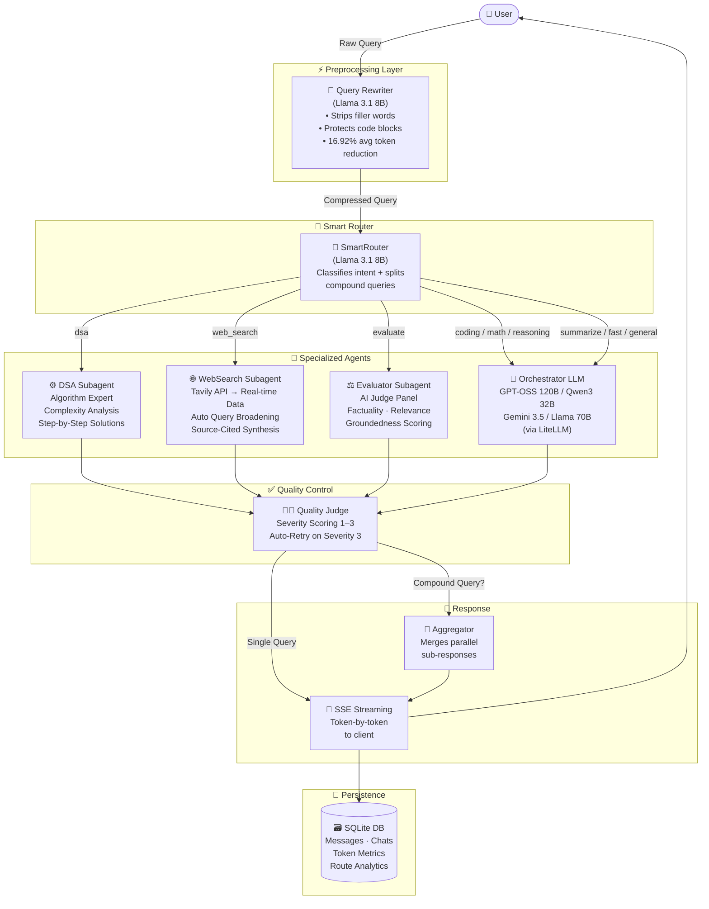

<div align="center">

# 🔷 PrismAI

### Multi-Agent AI Orchestration Platform

**[🚀 Live Demo](https://prism-ai-rust.vercel.app/) · [📂 Repository](https://github.com/karthik-0306/PrismAI)**

[](https://python.org)
[](https://fastapi.tiangolo.com)
[](https://react.dev)
[](https://litellm.ai)
[](https://render.com)
[](https://vercel.com)

*An intelligent, production-grade AI platform that dynamically routes every user query to the most suitable specialized agent, achieving a measured **16.92% average reduction in token overhead** without degrading output quality.*

</div>

---

## 📸 Screenshot

> *(Add a screenshot of the homepage here)*

```
<!-- Replace this comment with:  -->
```

---

## 🧠 System Architecture

The following diagram shows the complete end-to-end flow of every query through PrismAI:



---

## ✨ Features

### 🔀 Intelligent Multi-Agent Routing
PrismAI's `SmartRouter` analyses every query using a lightweight Llama 3.1 8B model and classifies it into one of **9 categories**, dispatching it to the most capable specialized agent. Compound queries (e.g. *"explain binary search AND what is quantum computing?"*) are automatically split and processed in **parallel**, with responses merged by the Aggregator.

| Route | Agent/Handler | Best For |
|---|---|---|
| `dsa` | DSA Subagent | Algorithms, LeetCode, complexity analysis |
| `web_search` | WebSearch Subagent | Real-time info, current events, prices |
| `evaluate` | Evaluator Subagent | Scoring AI responses, factuality checks |
| `coding` | GPT-OSS 120B | Debugging, refactoring, code generation |
| `math` | Qwen3 32B | Proofs, calculus, numerical computation |
| `reasoning` | Qwen3 32B | Logic puzzles, argument analysis |
| `summarize` | Llama 70B | Condensing documents and text |
| `fast` | Llama 8B Instant | Trivial one-liner answers |
| `general` | Gemini 3.5 Flash | Everything else |

---

### ⚡ Query Rewriter (Prompt Compression)
A dedicated preprocessing agent compresses verbose user prompts before they reach expensive models. This acts as a transparent **cost-reduction layer**:
- Strips conversational filler (*"Hey, could you please help me with..."*)
- Restructures intent for model clarity
- **Strictly protects** code blocks, raw data, and document payloads
- Measures and logs token savings to the database in real time
- **Achieves 16.92% average token reduction** across a 100-query dataset, tested on realistic distributions of natural language, code, and summarization tasks
- Displays live **✂️ savings chip** in the UI showing per-message token reduction

---

### 🌐 Real-Time Web Search Agent
A fully async subagent powered by the **Tavily Search API** (purpose-built for AI agents):
- Fetches clean, pre-extracted content from the web (no raw HTML scraping)
- **Automatic query broadening** — if a hyper-local query (e.g. *"gold price in Tenali"*) returns sparse results, it automatically retries with a broader query
- Tavily's own AI-synthesized answer is injected as an additional context source
- LLM synthesizes all results into a cited, markdown-formatted response
- All results are cited with inline source links

---

### ⚙️ DSA Subagent
A highly specialized algorithm expert with:
- Deep reasoning prompts tuned for algorithm explanation, correctness proofs, and time/space complexity analysis
- Structured step-by-step solution format
- Dedicated fallback model chain for reliability

---

### ⚖️ AI Evaluator & Quality Judge
A two-tier quality control system:
1. **Evaluator Subagent** — runs a multi-metric AI judge panel to score responses on factuality, relevance, and groundedness
2. **Auto-Retry** — responses scoring Severity 3 (poor quality) trigger an automatic re-split and retry with a different model — the user always gets the best possible output

---

### 📡 Token-by-Token SSE Streaming
- Real-time streaming via **Server-Sent Events (SSE)** — characters appear as they are generated
- Compound queries gracefully fall back to a non-streaming path with a "Thinking..." indicator
- Zero-latency token delivery with a persistent connection

---

### 📊 Analytics Dashboard
An interactive, built-in analytics dashboard (powered by **Recharts**) showing:
- Total token usage over time
- Tokens saved by the Query Rewriter per day (timeline chart)
- Agent routing distribution (which categories are used most)
- Model usage breakdown
- Chat volume trends

---

### 💬 Chat History & Session Management
- Browser `localStorage`-based UUID session management — **no login required**, every visitor gets a private, isolated session
- Full conversation history persisted to SQLite
- Sidebar search — keyword search across all past conversations
- One-click chat deletion (cascades to all associated messages in the database)
- Chat history survives page refreshes

---

### 🩺 System Health Monitor
- Live model health checker that pings all configured LLM providers
- Real-time status indicators (`Healthy`, `Degraded`, `Offline`) for Gemini, Groq, HuggingFace
- Visible in the sidebar so users know what is available

---

## 🛠️ Tech Stack

| Layer | Technology | Purpose |
|---|---|---|
| **Frontend** | React 18 + Vite | UI framework |
| **Styling** | Vanilla CSS Modules | Scoped, zero-runtime styles |
| **Charts** | Recharts | Analytics dashboard |
| **Backend** | FastAPI (Python 3.11) | API server, SSE streaming |
| **LLM Gateway** | LiteLLM | Universal multi-provider LLM abstraction |
| **LLM Providers** | Groq, Gemini, HuggingFace | Model inference |
| **Web Search** | Tavily API | AI-optimised real-time search |
| **Database** | SQLite + aiosqlite | Async persistent storage |
| **Token Counter** | tiktoken | Per-message token accounting |
| **Frontend Host** | Vercel | Zero-cold-start static hosting |
| **Backend Host** | Render | Python web service |

---

## 🗂️ Project Structure

```
PrismAI/
│
├── backend/
│   ├── main.py                 # FastAPI app, CORS, lifespan
│   ├── pipeline/
│   │   ├── orchestrator.py     # Core routing, dispatch, aggregation
│   │   ├── router.py           # SmartRouter (intent classification)
│   │   └── rewriter.py         # Query compression agent
│   ├── subagents/
│   │   ├── dsa_agent.py        # Algorithm specialist
│   │   ├── web_search_agent.py # Tavily-powered search agent
│   │   └── evaluator_agent.py  # AI judge panel
│   ├── llm/
│   │   └── client.py           # LiteLLM abstraction (completions + streaming)
│   ├── database/
│   │   ├── connection.py       # aiosqlite connection + schema init
│   │   ├── models.py           # Typed dataclasses (Chat, Message)
│   │   └── queries.py          # All SQL — parameterised, async
│   ├── routers/
│   │   ├── chat.py             # POST /api/chat
│   │   ├── streaming.py        # POST /api/chat/stream (SSE)
│   │   ├── history.py          # GET/DELETE /api/chats
│   │   └── metrics.py          # GET /api/metrics
│   └── utils/
│       ├── session.py          # UUID validation
│       └── token_counter.py    # tiktoken wrapper
│
├── frontend/
│   ├── src/
│   │   ├── App.jsx             # Root component + global state
│   │   ├── api/chat.js         # All HTTP/SSE calls to backend
│   │   ├── hooks/useSession.js # localStorage UUID session hook
│   │   └── components/
│   │       ├── Sidebar.jsx     # Nav, model selector, chat history
│   │       ├── ChatArea.jsx    # Message list + input bar
│   │       ├── MessageBubble.jsx   # Renders messages + badges + savings chip
│   │       ├── AnalyticsDashboard.jsx  # Recharts analytics view
│   │       └── SystemHealth.jsx    # Live model status pinger
│   └── vercel.json             # SPA routing config
│
├── render.yaml                 # Render deployment config
├── requirements.txt            # Python dependencies
└── .python-version             # Pins Python 3.11 for Render
```

---

## 🚀 Running Locally

### Prerequisites
- Python **3.11** (recommended)
- Node.js **18+**
- API Keys: [Groq](https://console.groq.com), [Gemini](https://aistudio.google.com), [Tavily](https://app.tavily.com)

### 1. Clone the repository
```bash
git clone https://github.com/karthik-0306/PrismAI.git
cd PrismAI
```

### 2. Set up environment variables
```bash
cp .env.example .env
```
Edit `.env` with your API keys:
```env
GEMINI_API_KEY=your_key_here
GROQ_API_KEY=your_key_here
TAVILY_API_KEY=your_key_here
HF_TOKEN=your_key_here
```

### 3. Set up the Python backend
```bash
# Create and activate a virtual environment
conda create -n ai_env python=3.11
conda activate ai_env

# Install all Python dependencies
pip install -r requirements.txt

# Start the FastAPI server
uvicorn backend.main:app --reload --port 8000
```
> The backend will be live at `http://localhost:8000`

### 4. Set up the React frontend (in a new terminal)
```bash
cd frontend
npm install
npm run dev
```
> The frontend will be live at `http://localhost:5173`

---

## 🌐 Deployment

PrismAI is deployed using a professional split-stack architecture:

| Service | Platform | URL |
|---|---|---|
| **Frontend** | Vercel | [prism-ai-rust.vercel.app](https://prism-ai-rust.vercel.app) |
| **Backend** | Render | [prismai-backend-mruh.onrender.com](https://prismai-backend-mruh.onrender.com) |

> **Note:** The backend uses Render's free tier, which may take ~30 seconds to wake up from cold start on the first request. The frontend on Vercel always loads instantly.

---

## 📈 Key Metrics

| Metric | Value |
|---|---|
| Intent Categories | 9 |
| LLM Providers | 3 (Groq, Gemini, HuggingFace) |
| Active Model Options | 6 |
| Avg Token Reduction (Query Rewriter) | **16.92%** |
| Streaming Protocol | Server-Sent Events (SSE) |
| Database | SQLite (async, session-isolated) |

---

## 📄 License

MIT License — feel free to fork, extend, and build on top of PrismAI.

---

<div align="center">

Built with ♥ as a portfolio demonstration of production-grade multi-agent AI systems.

**[🚀 Try it Live](https://prism-ai-rust.vercel.app/)**

</div>
