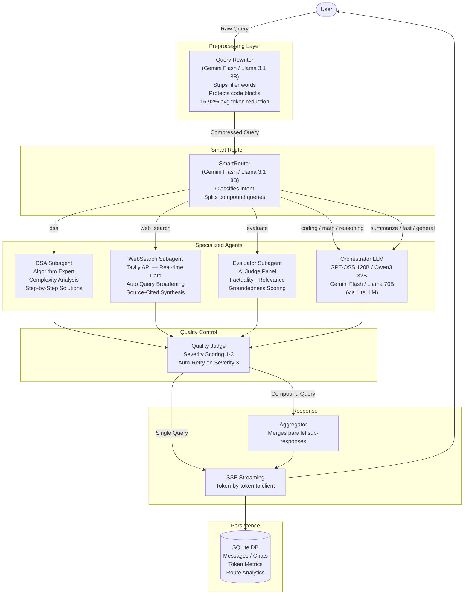

<div align="center">

# PrismAI

### Multi-Agent AI Orchestration Platform

**[Live Demo](https://prism-ai-rust.vercel.app/) · [Repository](https://github.com/karthik-0306/PrismAI)**

[](https://python.org)
[](https://fastapi.tiangolo.com)
[](https://react.dev)
[](https://litellm.ai)
[](https://render.com)
[](https://vercel.com)

*An intelligent, production-grade AI platform that dynamically routes every user query to the most suitable specialized agent, achieving a measured **16.92% average reduction in token overhead** without degrading output quality.*

</div>

---

## System Architecture

Every query flows through a five-stage pipeline before a response is returned to the user:



---

## Features

### Intelligent Multi-Agent Routing

PrismAI's `SmartRouter` classifies every query into one of 9 categories using a lightweight model, then dispatches it to the most capable agent. Compound queries (e.g. *"explain binary search AND what is quantum computing?"*) are automatically split and processed in parallel, with responses merged by the Aggregator.

| Route | Agent / Handler | Best For |
|---|---|---|
| `dsa` | DSA Subagent | Algorithms, LeetCode, complexity analysis |
| `web_search` | WebSearch Subagent | Real-time info, current events, prices |
| `evaluate` | Evaluator Subagent | Scoring AI responses, factuality checks |
| `coding` | GPT-OSS 120B | Debugging, refactoring, code generation |
| `math` | Qwen3 32B | Proofs, calculus, numerical computation |
| `reasoning` | Qwen3 32B | Logic puzzles, argument analysis |
| `summarize` | Llama 70B | Condensing documents and text |
| `fast` | Llama 8B Instant | Trivial one-liner answers |
| `general` | Gemini Flash | Everything else |

---

### Query Rewriter — Prompt Compression

A dedicated preprocessing step compresses verbose user prompts before they reach expensive models, acting as a transparent cost-reduction layer:

- Strips conversational filler (*"Hey, could you please help me with..."*)
- Restructures intent for model clarity
- Strictly preserves code blocks, raw data, and document payloads
- Measures and logs token savings to the database in real time
- **Achieves 16.92% average token reduction** across a 100-query evaluation dataset
- Displays a per-message savings chip in the UI showing the reduction percentage

---

### Real-Time Web Search Agent

A fully async subagent powered by the **Tavily Search API**:

- Fetches clean, pre-extracted content — no raw HTML scraping
- **Automatic query broadening** — if a hyper-local query returns sparse results, it retries with a broader query automatically
- Tavily's AI-synthesized answer is injected as an additional context source
- All results are cited with inline source links

---

### DSA Subagent

A specialized algorithm expert with deep reasoning prompts tuned for:

- Algorithm explanation and correctness proofs
- Time/space complexity analysis
- Structured step-by-step LeetCode-style solutions
- Dedicated model fallback chain for reliability

---

### AI Evaluator and Quality Judge

A two-tier quality control system:

1. **Evaluator Subagent** — a multi-metric AI judge panel scoring responses on factuality, relevance, and groundedness
2. **Auto-Retry** — responses scoring Severity 3 (poor quality) trigger an automatic retry with a different model

---

### Token-by-Token SSE Streaming

- Real-time streaming via **Server-Sent Events** — tokens appear as they are generated
- Compound queries gracefully fall back to a non-streaming path with a "Thinking..." indicator
- Zero-latency token delivery with a persistent connection

---

### Analytics Dashboard

An interactive built-in dashboard (powered by **Recharts**) showing:

- Total token usage and tokens saved by the Query Rewriter over time
- Agent routing distribution across intent categories
- Model usage breakdown
- Chat volume trends

---

### Chat History and Session Management

- `localStorage`-based UUID session management — no login required, every visitor gets a private isolated session
- Full conversation history persisted to SQLite
- Keyword search across all past conversations
- One-click chat deletion with cascade to all associated messages

---

## Tech Stack

| Layer | Technology | Purpose |
|---|---|---|
| **Frontend** | React 18 + Vite | UI framework |
| **Styling** | CSS Modules | Scoped, zero-runtime styles |
| **Charts** | Recharts | Analytics dashboard |
| **Backend** | FastAPI (Python 3.11) | API server, SSE streaming |
| **LLM Gateway** | LiteLLM | Universal multi-provider LLM abstraction |
| **LLM Providers** | Groq, Gemini, HuggingFace | Model inference |
| **Web Search** | Tavily API | AI-optimised real-time search |
| **Embeddings** | sentence-transformers (local) | Semantic similarity for memory |
| **Database** | SQLite + aiosqlite | Async persistent storage |
| **Token Counter** | tiktoken | Per-message token accounting |
| **Frontend Host** | Vercel | Static hosting |
| **Backend Host** | Render | Python web service |

---

## Project Structure

```
PrismAI/
│
├── backend/
│   ├── main.py                     # FastAPI app, CORS, lifespan
│   ├── pipeline/
│   │   ├── orchestrator.py         # Core routing, dispatch, aggregation
│   │   ├── router.py               # SmartRouter (intent classification)
│   │   ├── rewriter.py             # Query compression agent
│   │   └── memory.py               # Conversation memory injection
│   ├── subagents/
│   │   ├── dsa_agent.py            # Algorithm specialist
│   │   ├── web_search_agent.py     # Tavily-powered search agent
│   │   └── evaluator_agent.py      # AI judge panel
│   ├── llm/
│   │   ├── client.py               # LiteLLM abstraction (completions + streaming)
│   │   └── embeddings.py           # Local sentence-transformers wrapper
│   ├── database/
│   │   ├── connection.py           # aiosqlite connection + schema init
│   │   ├── models.py               # Typed dataclasses (Chat, Message)
│   │   └── queries.py              # All SQL — parameterised, async
│   ├── routers/
│   │   ├── chat.py                 # POST /api/chat
│   │   ├── streaming.py            # POST /api/chat/stream (SSE)
│   │   ├── history.py              # GET/DELETE /api/chats
│   │   └── metrics.py              # GET /api/metrics, GET /api/model-status
│   ├── utils/
│   │   ├── session.py              # UUID validation
│   │   └── token_counter.py        # tiktoken wrapper
│   └── evaluation/
│       ├── test_rewriter_quality.py    # Query rewriter benchmark
│       ├── rewriter_eval_results.csv   # Evaluation results (100-query dataset)
│       └── analyze_failures.py         # Failure analysis utilities
│
├── frontend/
│   ├── src/
│   │   ├── App.jsx                 # Root component + global state
│   │   ├── index.css               # Global design system / CSS variables
│   │   ├── api/
│   │   │   ├── chat.js             # HTTP/SSE calls to backend
│   │   │   └── metrics.js          # Analytics and model-status calls
│   │   ├── hooks/
│   │   │   ├── useSession.js       # localStorage UUID session hook
│   │   │   └── useBackendStatus.js # Backend health polling hook
│   │   └── components/
│   │       ├── Sidebar.jsx             # Nav, model selector, chat history
│   │       ├── ChatArea.jsx            # Message list + input bar
│   │       ├── MessageBubble.jsx       # Renders messages, badges, savings chip
│   │       ├── AnalyticsDashboard.jsx  # Recharts analytics view
│   │       └── ServerStatusBanner.jsx  # Backend cold-start status banner
│   └── vercel.json                 # SPA routing config
│
├── render.yaml                     # Render deployment config
├── requirements.txt                # Python dependencies
└── .python-version                 # Pins Python 3.11 for Render
```

---

## Running Locally

### Prerequisites

- Python **3.11**
- Node.js **18+**
- API keys for [Groq](https://console.groq.com), [Gemini](https://aistudio.google.com), [Tavily](https://app.tavily.com), and [HuggingFace](https://huggingface.co/settings/tokens)

### 1. Clone the repository

```bash
git clone https://github.com/karthik-0306/PrismAI.git
cd PrismAI
```

### 2. Configure environment variables

```bash
cp .env.example .env
```

Edit `.env` with your API keys:

```env
GEMINI_API_KEY=your_gemini_key
GROQ_API_KEY=your_groq_key
TAVILY_API_KEY=your_tavily_key
HF_TOKEN=your_huggingface_token
```

> `HF_TOKEN` is required for HuggingFace model inference. Create a read-access token at [huggingface.co/settings/tokens](https://huggingface.co/settings/tokens).

### 3. Start the backend

```bash
# Create and activate a virtual environment
python -m venv .venv
source .venv/bin/activate   # Windows: .venv\Scripts\activate

# Install dependencies
pip install -r requirements.txt

# Start the FastAPI server
uvicorn backend.main:app --reload --port 8000
```

> The backend will be available at `http://localhost:8000`

> **Note:** On first run, the sentence-transformers embedding model (`all-MiniLM-L6-v2`, ~90 MB) will be downloaded and cached. Subsequent starts load it from disk in ~1 second.

### 4. Start the frontend

```bash
cd frontend
npm install
npm run dev
```

> The frontend will be available at `http://localhost:5173`. Vite proxies all `/api/*` requests to the FastAPI backend automatically.

---

## Deployment

PrismAI uses a split-stack deployment:

| Service | Platform | URL |
|---|---|---|
| **Frontend** | Vercel | [prism-ai-rust.vercel.app](https://prism-ai-rust.vercel.app) |
| **Backend** | Render | [prismai-backend-mruh.onrender.com](https://prismai-backend-mruh.onrender.com) |

**Environment variables required on Render:**
`GEMINI_API_KEY`, `GROQ_API_KEY`, `TAVILY_API_KEY`, `HF_TOKEN`, `FRONTEND_URL` (set to your Vercel URL to allow CORS).

> The backend runs on Render's free tier, which cold-starts after inactivity. The first request may take 30–60 seconds; the frontend displays a status banner during this period.

---

## Key Metrics

| Metric | Value |
|---|---|
| Intent categories | 9 |
| LLM providers | 3 (Groq, Gemini, HuggingFace) |
| Available models | 6 |
| Avg token reduction (Query Rewriter) | **16.92%** |
| Evaluation dataset | 100 queries |
| Streaming protocol | Server-Sent Events (SSE) |
| Database | SQLite (async, session-isolated) |

---

## License

MIT License — free to fork, extend, and build upon.
